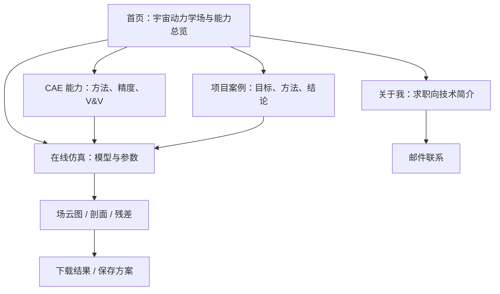
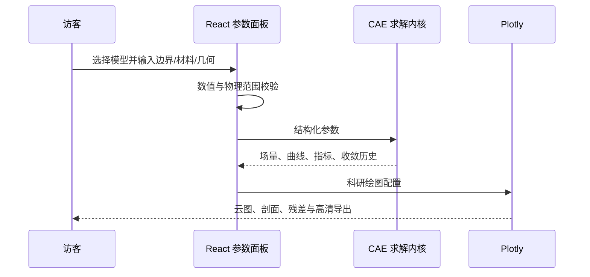

# PhyTwin 网站整体架构与页面流程

## 1. 分层架构

| 层级 | 目录 | 职责 |
|---|---|---|
| 前端 UI | `source/src/App.jsx`, `source/src/styles.css` | React 多页面路由、ChatGPT 式交互、Apple 式动效与响应式布局 |
| 宇宙交互 | `source/src/components/CosmicExplorer.jsx`, `source/src/data/bright-stars-compact.json` | J2000 肉眼亮星天球、银河系与 M31 差分旋转粒子场、天琴座与天龙座空间拓扑 |
| 浏览器仿真 | `source/src/lib/solver.js` | 结构梁、二维导热、圆柱势流的确定性求解与输入校验 |
| 数据可视化 | `Plotly.js CDN + React 适配层` | 场云图、剖面曲线、对数残差、交互提示和高清 PNG 导出 |
| 后端计算 | `backend/app.py` | FastAPI 统一计算协议，可替换为更高保真 FEM/CFD 内核 |
| 发布 | `根目录静态产物` + `CNAME` | Vite 构建结果通过 GitHub Pages 服务 `www.phytwin.com` |

## 2. 页面流程图

## 3. 在线仿真数据流

## 4. 已实现求解模型

1. **悬臂梁静力分析**：Euler–Bernoulli 梁基准，输出位移、弯曲应力、安全系数。
2. **二维稳态导热**：温度边界与体热源，输出温度场、中心剖面、热流指标。
3. **圆柱势流**：不可压无旋理论解，输出速度场、表面压力系数与雷诺数。

线上模型用于展示完整计算链路。实际工程必须补充材料标定、网格无关性、实验验证和不确定性分析。

## 5. UI 与可视化原则

- 低饱和暖灰背景与高对比石墨文本，钴蓝仅用于关键状态与操作。
- 所有图表包含单位、坐标轴、色标、科学配色与悬停读数。
- Plotly 工具栏提供 3× 比例 PNG 导出；结果数据支持 JSON 下载。
- `prefers-reduced-motion`、键盘焦点、移动端布局和触控尺寸均有适配。
- 全站采用深蓝计算空间主题，面向客户保留完整参数、工程判断与结果指标。
